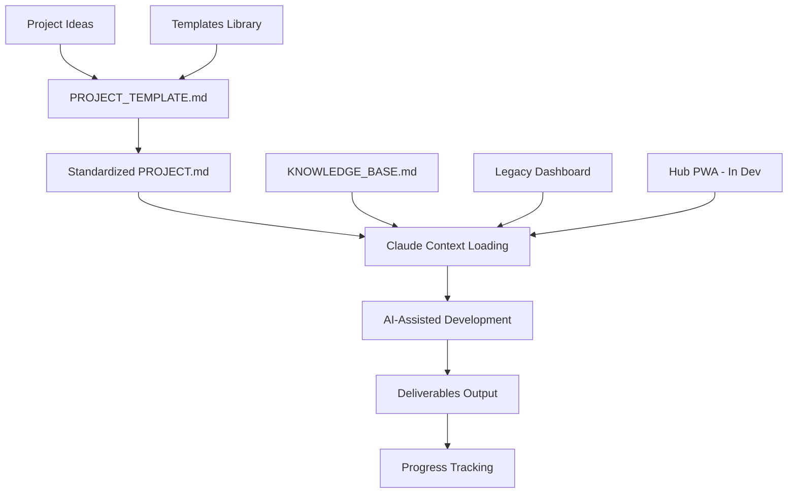

# 🎯 Claude Project Hub

**The AI-powered project management system that scales from 1 to 100+ projects without chaos.**


---

## 🌟 Why Claude Project Hub?

**Stop context-switching chaos.** **Stop recreating project setups.** **Stop losing track of what you're building.**

**Start building with AI assistance that actually scales.**

### The Problem
- 🔥 Multiple projects = context switching nightmare
- 📝 Each new project = starting from scratch  
- 🤖 Claude forgets your project every session
- ⚡ No standardized way to work with AI on complex projects
- 📱 Can't work from mobile (limited claude.ai mobile UX)

### The Solution  
- 🎯 **Standardized PROJECT.md** → Claude understands instantly
- 🚀 **Template system** → New projects in 10 minutes
- 📊 **Unified interfaces** → Legacy dashboard + Hub PWA (in development)
- 🤖 **AI-optimized workflows** → Maximum productivity with Claude
- 📱 **Mobile-first Hub** → Work from iPhone, iPad, anywhere

---

## ⚡ Quick Start (2 Minutes)

### 1. Clone & Setup
```bash
git clone https://github.com/Noobucodonosor/claude-24h-project
cd claude-24h-project
open app/frontend/index.html  # Launch legacy dashboard
```

### 2. Load in Claude
```
"Add from GitHub: https://github.com/Noobucodonosor/claude-24h-project

I use Claude Project Hub to manage multiple AI-assisted projects. 
What projects do you see and what should we work on?"
```

### 3. Start Building
Choose any project from dashboard → Copy context → Work with Claude → Ship faster! 🚀

---

## 📊 Active Projects

<table>
<tr>
<td width="25%">

### 🌐 **Claude Project Hub**
**PWA for Project Management**

🔧 React + Vercel + GitHub API  
📈 Active Development (30%)  
📱 Mobile-First PWA  

**Next**: Phase 1 - Basic web app + Claude API

</td>
<td width="25%">

### 🎮 **MTG Web App**
**AI Deck Generator + Live Referee**

🔧 FastAPI + React + MLX  
📈 Planning → Development (40%)  
⚡ Apple Silicon Optimized  

**Next**: Environment setup + dependencies

</td>
<td width="25%">

### 🥗 **Cucina Vegana** 
**Complete Kitchen Management**

🔧 HTML/JS + JSON Database  
📈 Active Development (65%)  
🎯 Recipe DB + Meal Planner  

**Next**: Complete 30-recipe database

</td>
<td width="25%">

### 📚 **Università**
**AI-Enhanced Study System**

🔧 Obsidian + Claude + Anki  
📈 Active Development (30%)  
🧠 Evidence-based Methods  

**Next**: Note templates + Claude integration

</td>
</tr>
</table>

---

## 🏗️ System Architecture



**3 Core Layers:**
- 📂 **Storage**: Structured projects with standardized docs
- 🤖 **AI Integration**: Optimized Claude context loading
- 🎨 **Interface**: 
  - **Legacy Dashboard** (functional, static HTML)
  - **Hub PWA V1.0** (in development, React + Claude API)

---

## 🚀 Key Features

### ✅ **Currently Available**
- **📋 Standardized PROJECT.md Format** - Claude understands any project instantly
- **🎨 Project Templates** - WebApp, Study, Creative, Research ready-to-use
- **📊 Legacy Dashboard** - All projects status at a glance  
- **🧠 Optimized Knowledge Base** - Fast Claude context loading
- **🔄 Git Workflow Integration** - Version control everything
- **📱 Mobile-Friendly** - Legacy dashboard works on all devices

### 🚧 **In Active Development**
- **🌐 Hub PWA** - Progressive Web App with Claude API integration
- **📱 Mobile-First UX** - iPhone + desktop optimized interface
- **🤖 Direct Claude Integration** - In-app chat with auto-context
- **🔄 GitHub Auto-Sync** - Auto-read/write PROJECT.md files
- **💾 Offline Mode** - Work without internet, sync later
- **🔐 Session Persistence** - Conversations saved locally

### 💡 **Planned Features** 
- **👥 Multi-User Collaboration** - Share projects with team
- **☁️ Cloud Sync** - Cross-device project access
- **🎙️ Voice Input** - Voice-to-text for mobile
- **🔌 Workflow Automation** - n8n/Zapier integrations

---

## 🛠️ Tech Stack

### **Core System**
- **Storage**: File system + Git (human-readable, version controlled)
- **Legacy Dashboard**: HTML5 + CSS3 + Vanilla JS (zero dependencies)
- **Hub PWA**: React 18 + TypeScript + Vite
- **Backend**: Vercel Serverless Functions
- **AI**: Claude API integration + local LLMs (planned)

### **Project Technologies**
- **Web Apps**: React, FastAPI, Next.js, PostgreSQL
- **AI/ML**: MLX (Apple Silicon), Ollama, HuggingFace  
- **Study Tools**: Obsidian, Markdown, Anki
- **Creative Projects**: Custom HTML/JS, JSON databases

### **Development**
- **Version Control**: Git + GitHub
- **Editor**: VS Code (recommended)
- **Platform**: macOS optimized (Apple Silicon native)
- **Deployment**: Vercel (Hub), local (other projects)

---

## 📋 Project Types & Templates

| Template | Use Case | Example | Tech Stack |
|----------|----------|---------|------------|
| 🌐 **WebApp** | Full-stack applications | Hub PWA, MTG Web App | React, FastAPI |
| 📚 **Study** | Learning & research | University System | Obsidian + AI |
| 🎨 **Creative** | Design & lifestyle | Vegan Kitchen | HTML/JS |
| 🔧 **Tool** | Utilities & automation | Scripts & CLIs | Python |

**Each template includes:**
- ✅ Complete PROJECT.md structure
- ✅ Folder organization
- ✅ Development phases
- ✅ SESSION_HANDOFF for continuity
- ✅ Claude integration guides

---

## 🔄 Workflow Examples

### **Using Legacy Dashboard (Current)**
```bash
open app/frontend/index.html
# Click project → Copy context → Paste in claude.ai → Work
```

### **Using Hub PWA (When V1.0 Ready - Nov 2025)**
```bash
# Open hub.yourname.vercel.app
# Install to home screen (iPhone/desktop)
# Select project → Context auto-loads
# Chat with Claude in-app → Code auto-saves
```

### **New Project (10 Minutes)**
```bash
mkdir -p projects/my-app/{context,deliverables}
cp PROJECT_TEMPLATE.md projects/my-app/PROJECT.md
# Ask Claude to help fill template → Start building!
```

### **Project Completion**
```bash
Update PROJECT.md → Commit deliverables → Mark completed → Celebrate! 🎉
```

---

## 📊 System Stats

- **📂 Projects Managed**: 4 active + unlimited capacity
- **⚡ Setup Time**: <5 minutes first time, <30 seconds per session
- **📝 Documentation**: 100+ pages optimized for AI consumption
- **🤖 Claude Efficiency**: 10x faster context loading with SESSION_HANDOFF
- **💾 Storage**: ~50MB per project average (including deliverables)

---

## 🎯 Success Stories

### **Before Claude Project Hub**
- ❌ 30 minutes context switching between projects
- ❌ Recreating project structure every time
- ❌ Claude confused about project context
- ❌ Lost track of what was built where
- ❌ Can't work from mobile effectively

### **After Claude Project Hub**  
- ✅ **30 seconds** to switch project context
- ✅ **10 minutes** to start any new project
- ✅ **Claude instantly** understands project scope
- ✅ **Zero projects abandoned** - all tracked and organized
- ✅ **Work from anywhere** - Hub PWA enables mobile workflow

---

## 🌐 Hub PWA - The Future (V1.0 Target: Nov 2025)

### What Makes Hub Special

**Progressive Web App**:
- 📱 Install on iPhone home screen
- 💻 Works on desktop browsers
- 🔌 Offline-capable with service worker
- ⚡ Fast, native-like performance

**Claude API Integration**:
- 🤖 Chat with Claude directly in-app
- 📂 Auto-load PROJECT.md context
- 💾 Auto-save generated code
- 🔄 Auto-update PROJECT.md via GitHub API

**Mobile-Optimized**:
- 👆 Touch-friendly interface
- 📲 Bottom navigation (iPhone-friendly)
- 🎨 Responsive design (mobile-first)
- 🌙 Dark mode support

**Session Persistence**:
- 💬 Conversations saved locally (IndexedDB)
- 🔄 Refresh browser = continue conversation
- 📊 History accessible across devices

### Current Hub Development Status

```
Phase 0: Repo Optimization    [██████░░░░░░░░░░░░░░]  30% ← Current
Phase 1: Basic Web App         [░░░░░░░░░░░░░░░░░░░░]   0%
Phase 2: GitHub + Context      [░░░░░░░░░░░░░░░░░░░░]   0%
Phase 3: Code Artifacts        [░░░░░░░░░░░░░░░░░░░░]   0%
Phase 4: Auto-Commit + Memory  [░░░░░░░░░░░░░░░░░░░░]   0%
Phase 5: PWA + Mobile Polish   [░░░░░░░░░░░░░░░░░░░░]   0%
```

**Next Milestone**: Setup React + Vite project, Claude API integration

---

## 🚀 Get Started Now

### **For Individual Developers**
1. **Fork/Clone this repository**
2. **Open legacy dashboard** (`app/frontend/index.html`)
3. **Load in Claude** (copy repo URL)
4. **Start your first project!**
5. **Watch for Hub V1.0** (November 2025)

### **For Hub Development** (Contribute!)
```bash
cd hub/deliverables/frontend
# Setup coming in Phase 1 (Week 2)
# React + Vite + Claude API integration
```

---

## 🤝 Contributing

### **Ways to Contribute**
- 🐛 **Bug Reports**: Open issues for any problems
- 💡 **Feature Requests**: Suggest new functionality
- 📋 **Template Contributions**: Share your project templates
- 📝 **Documentation**: Improve guides and examples
- 🌐 **Hub Development**: Help build the PWA (Phase 1+)

### **Development Setup**
```bash
git clone https://github.com/Noobucodonosor/claude-24h-project
cd claude-24h-project
# Legacy dashboard: No build needed - open index.html
# Hub PWA: Coming in Phase 1
```

---

## 📚 Documentation

- **[📋 PROJECT_TEMPLATE.md](PROJECT_TEMPLATE.md)** - Standard template for new projects
- **[🧠 KNOWLEDGE_BASE.md](KNOWLEDGE_BASE.md)** - Complete system context for Claude  
- **[🔄 docs/WORKFLOW.md](docs/WORKFLOW.md)** - Detailed usage workflows
- **[⚙️ docs/SETUP.md](docs/SETUP.md)** - Technical setup guide
- **[🚀 project-creation-guide.md](project-creation-guide.md)** - How to create new projects

---

## 🏆 Why This Approach Works

### **Scientifically Optimized**
- **🧠 Cognitive Load Theory**: Standardized formats reduce mental overhead
- **⚡ Context Switching Cost**: Minimized through consistent structure  
- **🤖 AI Efficiency**: Optimized prompts and context for better AI responses
- **📈 Compound Productivity**: Each optimization benefits all future projects

### **Battle-Tested**
- **✅ 4 diverse projects** successfully managed (including meta-project Hub)
- **✅ SESSION_HANDOFF** enables perfect continuity between sessions
- **✅ 10x improvement** in Claude context loading speed
- **✅ Zero abandoned projects** since implementation
- **✅ Mobile-first** approach validated for Hub development

---

## 🔮 Roadmap

### **Q4 2025**
- ✅ Repository optimization complete
- 🚧 Hub Phase 1: Basic web app + Claude API
- 🚧 Hub Phase 2: GitHub integration + context engine

### **Q1 2026**
- 🎯 Hub V1.0 Release (PWA with full features)
- 🎯 Legacy dashboard retired (gracefully)
- 🎯 Mobile-first workflow validated

### **Q2 2026+**
- 💡 Multi-user features
- 💡 Voice input (Whisper integration)
- 💡 Workflow automation (n8n/Zapier)
- 💡 Template marketplace

---

## 📜 License

**Personal Use** - This system was built for individual productivity optimization.

Feel free to fork and adapt for your own use! If you build something cool with it, let me know! 🚀

---

## 🌟 Star This Repo!

If Claude Project Hub helps you build faster and manage projects better, give it a ⭐!

**Questions?** Open an issue or start a discussion. The system evolves based on real usage! 

---

<div align="center">

**🎯 CLAUDE PROJECT HUB**

*Your AI-Powered Project Command Center*

*From Chaos to Clarity • From Ideas to Shipped Products*

**Legacy Dashboard** (Available Now) • **Hub PWA** (Nov 2025)

**[🚀 Get Started](#-get-started-now) • [📊 See Projects](#-active-projects) • [📋 Use Templates](PROJECT_TEMPLATE.md)**

---

*Built with ❤️ and 🤖 for developers who ship*

*Now evolving into a mobile-first Progressive Web App* 📱

</div>