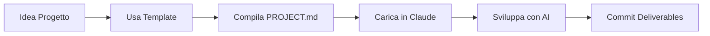

# 🎯 Claude Project Hub

**Meta-ambiente intelligente per gestire e sviluppare progetti multipli con Claude AI**


---

## 🌟 Cos'è Claude Project Hub

**Non è un singolo progetto** - è un **sistema unificato** per:
- 📥 Sottomettere nuovi progetti in formato standardizzato
- 🤖 Integrare Claude AI con context ottimizzato per ogni progetto
- 📊 Tracciare progress di progetti multipli in parallelo
- 🔄 Generare template per nuovi progetti futuri
- 🚀 Accedere rapidamente a qualsiasi progetto con AI contestualizzato

### Analogia
Pensa a Google Drive per i file → **Claude Hub per i progetti AI-assisted**

---

## 🏗️ Architettura Sistema

```
Claude Project Hub
│
├── 📱 Project Dashboard (UI)
│   └── Visualizza/gestisci tutti i progetti
│
├── 🧠 Claude Integration Layer
│   ├── Context Manager (carica KB progetto)
│   ├── API Integration (Claude API opzionale)
│   └── Template Generator (wizard nuovi progetti)
│
├── 📂 Project Storage
│   ├── Progetti attivi (MTG, Cucina, Università...)
│   ├── Template riutilizzabili
│   └── Deliverable organizzati
│
└── 🔧 Tools & Utilities
    ├── Document Parser (analizza doc progetti)
    ├── Progress Tracker
    └── Export/Import progetti
```

---

## 📁 Struttura Repository

```
claude-project-hub/
│
├── README.md                    ← Questo file
├── KNOWLEDGE_BASE.md            ← Context globale per Claude
├── PROJECT_TEMPLATE.md          ← Template standard progetti
│
├── app/                         ← Codice applicazione
│   ├── frontend/
│   │   ├── index.html          ← Dashboard progetti
│   │   ├── styles.css          ← Styling moderno
│   │   └── app.js              ← Logica UI
│   ├── backend/                ← (Opzionale) API backend
│   │   └── project_parser.py
│   └── config/
│       └── app_config.json
│
├── projects/                    ← Tutti i progetti
│   ├── mtg-webapp/
│   │   ├── PROJECT.md          ← Definizione progetto
│   │   ├── context/            ← File context specifici
│   │   └── deliverables/       ← Output finali
│   ├── cucina-vegana/
│   └── universita/
│
├── templates/                   ← Template progetti
│   ├── webapp_template.md
│   ├── study_template.md
│   └── creative_template.md
│
└── docs/                        ← Documentazione
    ├── SETUP.md
    ├── WORKFLOW.md
    └── API_GUIDE.md
```

---

## 🚀 Quick Start

### 1. Naviga nel Dashboard
```bash
# Apri il file nel browser
open app/frontend/index.html

# Oppure usa un server locale
cd app/frontend
python3 -m http.server 8000
# Vai su http://localhost:8000
```

### 2. Inizia Sessione Claude
Quando lavori su un progetto:

**Opzione A - Manuale**:
1. Apri `projects/[nome-progetto]/PROJECT.md`
2. Copia contenuto in nuova chat Claude
3. Aggiungi: "Questo è il context del progetto X"

**Opzione B - Con Knowledge Base** (consigliato):
1. Carica tutto il repository in Claude: "Aggiungi da GitHub"
2. Claude avrà accesso a KNOWLEDGE_BASE.md + tutti i progetti
3. Dì: "Lavoriamo sul progetto MTG"

### 3. Crea Nuovo Progetto
```bash
# Copia template
cp PROJECT_TEMPLATE.md projects/mio-nuovo-progetto/PROJECT.md

# Oppure usa wizard (TODO: in sviluppo)
# npm run create-project
```

---

## 📊 Progetti Attivi

### 🎮 MTG Web App
**Tipo**: Web Application  
**Status**: Planning → Development  
**Stack**: FastAPI + React + Claude API  
**Obiettivo**: Generatore mazzi + Arbitro AI live  
📁 `projects/mtg-webapp/`

### 🥗 Cucina Vegana
**Tipo**: Creative/Lifestyle  
**Status**: Active  
**Tools**: Recipe DB + Meal Planner  
**Obiettivo**: Sistema completo gestione cucina vegana  
📁 `projects/cucina-vegana/`

### 📚 Università
**Tipo**: Study/Research  
**Status**: Active  
**Tools**: Note synthesis + Exam prep  
**Obiettivo**: Ottimizzazione studio e preparazione esami  
📁 `projects/universita/`

---

## 🎨 Features del Sistema

### ✅ Implementate
- [x] Struttura repository organizzata
- [x] Template standard progetti
- [x] Knowledge base globale
- [x] Dashboard HTML base
- [x] Sistema cartelle modulare

### 🚧 In Sviluppo
- [ ] Dashboard interattiva con progress bars
- [ ] Document parser automatico
- [ ] Claude API integration in-app
- [ ] Template wizard guidato
- [ ] Export/Import progetti
- [ ] Git integration automatica

### 💡 Future Ideas
- [ ] Plugin system per moduli specifici
- [ ] Multi-user collaboration
- [ ] Cloud sync progetti
- [ ] Mobile app companion
- [ ] Analytics dashboard

---

## 🛠️ Workflow Tipico

### Scenario 1: Nuovo Progetto


### Scenario 2: Sessione Lavoro
```
1. Apri Dashboard → Seleziona progetto
2. Click "Open in Claude" → Context caricato automaticamente
3. Lavora con Claude sul progetto
4. Salva output in deliverables/
5. Aggiorna status progetto
6. Commit + Push
```

---

## 📖 Documentazione

- **[KNOWLEDGE_BASE.md](KNOWLEDGE_BASE.md)** - Context completo per Claude
- **[PROJECT_TEMPLATE.md](PROJECT_TEMPLATE.md)** - Template standard progetti
- **[docs/SETUP.md](docs/SETUP.md)** - Setup ambiente sviluppo
- **[docs/WORKFLOW.md](docs/WORKFLOW.md)** - Guide utilizzo dettagliate
- **[docs/API_GUIDE.md](docs/API_GUIDE.md)** - Integrazione Claude API

---

## 🤝 Contribuire

Questo è un sistema personale ma modularizzabile! Per aggiungere:

### Nuovo Progetto
1. Crea cartella in `projects/`
2. Copia `PROJECT_TEMPLATE.md`
3. Compila sezioni
4. Commit

### Nuovo Template
1. Crea file in `templates/`
2. Segui formato standard
3. Documenta in README

### Feature App
1. Branch feature
2. Sviluppa in `app/`
3. Test locale
4. Pull request

---

## 🔧 Tech Stack

### Core
- **Frontend**: HTML5 + CSS3 + Vanilla JS (zero dependencies)
- **Backend**: Python FastAPI (opzionale, per parser/API)
- **Database**: JSON files + SQLite (se necessario)
- **AI**: Claude API (Anthropic)

### Development
- **Version Control**: Git + GitHub
- **Editor**: Qualsiasi (VS Code consigliato)
- **Browser**: Chrome/Firefox/Safari moderni

---

## 📝 Formato Standard Progetto

Ogni progetto in `projects/` segue questo formato:

```
projects/nome-progetto/
├── PROJECT.md              ← Definizione completa (segue template)
├── context/                ← File context specifici progetto
│   ├── resources.md
│   └── notes.md
├── deliverables/           ← Output/risultati progetto
│   ├── code/
│   ├── documents/
│   └── assets/
└── .project-meta.json      ← Metadata (status, dates, tags)
```

---

## 🎯 Filosofia del Sistema

### Principi Core
1. **Un progetto = Un documento standard** - Facilita context loading
2. **Modularità** - Ogni progetto è indipendente
3. **Claude-first** - Tutto ottimizzato per AI assistance
4. **Zero friction** - Minimo overhead, massima produttività
5. **Scalabile** - Da 3 a 300 progetti senza problemi

### Anti-Pattern Evitati
- ❌ Knowledge base monolitico confuso
- ❌ Context switching manuale
- ❌ Progetti sparsi senza struttura
- ❌ Documentazione non standardizzata
- ❌ Overhead di gestione progetti

---

## 📈 Metriche

- **Progetti Attivi**: 3
- **Template Disponibili**: 3+
- **Lines of Code**: ~2000
- **Setup Time**: <5 minuti
- **Context Load Time**: <30 secondi

---

## 🆘 Troubleshooting

### Dashboard non si apre
```bash
# Verifica file esista
ls app/frontend/index.html

# Usa server locale
cd app/frontend && python3 -m http.server 8000
```

### Claude non vede progetti
```bash
# Verifica struttura
ls -R projects/

# Ricarica repository in Claude
# "Aggiungi da GitHub: https://github.com/[user]/claude-project-hub"
```

### Template non funziona
```bash
# Verifica formato
cat PROJECT_TEMPLATE.md

# Usa esempio esistente
cp projects/mtg-webapp/PROJECT.md projects/nuovo/PROJECT.md
```

---

## 📜 License

Personale - Uso privato

---

## 👤 Maintainer

Sviluppato con Claude AI per ottimizzare workflow sviluppo progetti multipli.

**Last Updated**: 2025-09-29  
**Version**: 1.0.0  
**Status**: 🟢 Active Development

---

## 🔗 Link Utili

- [Anthropic Claude](https://claude.ai)
- [GitHub Repository](https://github.com/[username]/claude-project-hub)
- [Project Template](PROJECT_TEMPLATE.md)
- [Knowledge Base](KNOWLEDGE_BASE.md)

---

<div align="center">

**🎯 Claude Project Hub - Your AI-Powered Project Command Center**

Made with ❤️ and 🤖

</div>
